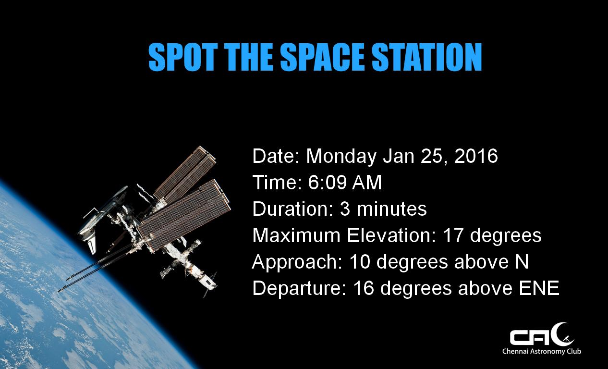

# fly

fly is an automated flyer/poster maker that works on Python and PIL.


#### Requirements

1. [PIL](http://pillow.readthedocs.org/en/3.0.x/installation.html)
2. Microsoft core fonts(if using Linux). Use `sudo apt-get install ttf-mscorefonts-installer`.

#### Installation

`git clone https://github.com/ChennaiAstronomyClub/fly`

cd into the fly directory and do
`python setup.py install`

#### Usage

```
import fly
flyer = fly.ISS()
flyer.fly("Message Here")
```
#### Sample



Functionality will be extended in the coming days to cover all our events. The following are the targets that are aimed to be covered.

- [x] ISS passes with [mercury](https://github.com/ChennaiAstronomyClub/mercury)
- [ ] Star Party invites
- [ ] Rocket Launch invites
- [ ] Monthly Meetup invites
- [ ] Outreach posters

#### License

MIT © [Chennai Astronomy Club](http://chennaiastronomyclub.org)